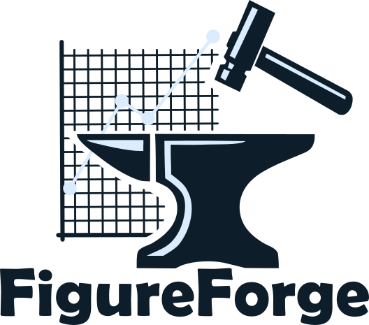

<p align="center">  </p>

A Python GUI application for interactive creation and editing of matplotlib figures.

## Features
- Edit matplotlib figures via a graphical interface.
  - Adjust text labels, size, fonts, etc.
  - Change colors of lines, text, symbols, etc.
  - Adjust size of markers, lines
  - And more!
- [Save figures](htthttps://github.com/nogula/FigureForge/wiki/FAQ-&-Troubleshooting#how-does-figureforge-save-figure-data) to a pickle file for use in other Python projects or to share (and load figures from a pickle file, too!).
- Use [custom plugins](https://github.com/nogula/FigureForge/wiki/Plugins) to automate figure styling.


## Installation

1. Open a terminal or command prompt.
2. Optionally, create a virtual environment.
3. Run the following command to install FigureForge:

    ```
    pip install git+https://github.com/nogula/FigureForge.git
    ```
    _You may need to uninstall FigureForge before upgrading._
4. Start FigureForge from the terminal:
    ```
    FigureForge
    ```

## Help
This project's wiki will host the documentation, but it hasn't been written yet... in the meantime, check out the [FAQ & Troubleshooting](https://github.com/nogula/FigureForge/wiki/FAQ-&-Troubleshooting) page, create a [new issue](https://github.com/nogula/FigureForge/issues), or ask a question in the [discussions](https://github.com/nogula/FigureForge/discussions/1).

## Contributing
Obviously, FigureForge is still early in development (no releases have been made yet). Correspondingly, there are many opportunities to implement features and fix bugs. If you want to pitch in, you are welcome to fork the project and make a pull request.

Truth be told, I am an aerospace engineer and not a software developer; I don't know how to develop professional software, but am doing my best - especially because FigureForge is solving one of my own problems. If you would like to contribute, I would be grateful. There is no roadmap, there are no planned features except those which I think I can work out in the next week or so, and there is no formal development software. But maybe you can help with that!