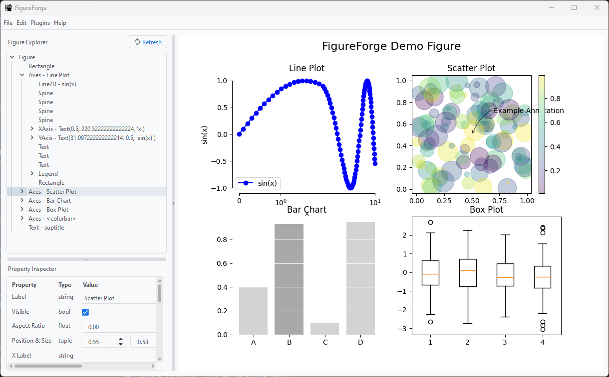

<p align="center">  </p>

A Python GUI application for interactive creation and editing of matplotlib figures.

## Features
- Edit matplotlib figures via a graphical interface.
  - Adjust text labels, size, fonts, etc.
  - Change colors of lines, text, symbols, etc.
  - Adjust size of markers, lines
  - And more!
- [Save figures](htthttps://github.com/nogula/FigureForge/wiki/FAQ-&-Troubleshooting#how-does-figureforge-save-figure-data) to a pickle file for use in other Python projects or to share (and load figures from a pickle file, too!).
- Use [custom plugins](https://github.com/nogula/FigureForge/wiki/Plugins) to automate figure styling.



## Installation

1. Open a terminal or command prompt.
2. Optionally, create a virtual environment.
3. Run the following command to install FigureForge:

    ```
    pip install git+https://github.com/nogula/FigureForge.git
    ```
    _You may need to uninstall FigureForge before upgrading._
4. Start FigureForge from the terminal:
    ```
    FigureForge
    ```

## Help
The documentation for FigureForge is available on the project's [wiki](https://github.com/nogula/FigureForge/wiki) -- it is still a work in progress, but in the meantime you might find the [FAQ & Troubleshooting](https://github.com/nogula/FigureForge/wiki/FAQ-&-Troubleshooting) page helpful. Consider also creating a [new issue](https://github.com/nogula/FigureForge/issues), or ask a question in the [discussions](https://github.com/nogula/FigureForge/discussions/1).

## Contributing
Obviously, FigureForge is still early in development. Correspondingly, there are many opportunities to implement features and fix bugs. If you want to pitch in, you are welcome to fork the project and make a pull request.

Truth be told, I am an aerospace engineer and not a software developer; I don't know how to develop professional software, but am doing my best - especially because FigureForge is solving one of my own problems. If you would like to contribute, I would be grateful. There is no formal development philosophy: I just recently learned that git tags are a thing. The closest thing to a development roadmap is this Kanban board, granted, these features are to some extent aspirational: [FigureForge Project](https://github.com/users/nogula/projects/3/views/1).

## Acknowledgements
FigureForge is possible only because of the open source technologies and resources from which FigureForge stands on shoulders. Specifically, I wish to thank:
- The developers of [matplotlib](https://matplotlib.org/) who are responsible for the very foundation of this project.
- The GUI framework for FigureForge is the Qt platform, specifically [PySide6](https://pypi.org/project/PySide6/).
- The menu [icons](https://fonts.google.com/icons) used in FigureForge were made by Google.

## See Also
A unique function of FigureForge is its ability to work on matplotlib figures as part of any Python workflow. However, if you are looking for something more polished and are not so concerned with the serialization/data format of your figure, you might find the following projects of interest.
- [Veusz](https://veusz.github.io/) is a scientific plotting and graphing program with a graphical user interface, designed to produce publication-ready 2D and 3D plots.
- [LabPlot](https://labplot.kde.org/) open source and cross-platform Data Visualization and Analysis software accessible to everyone.
